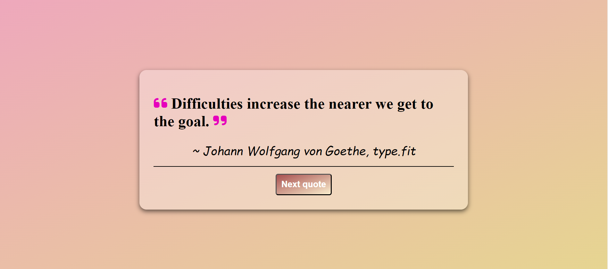
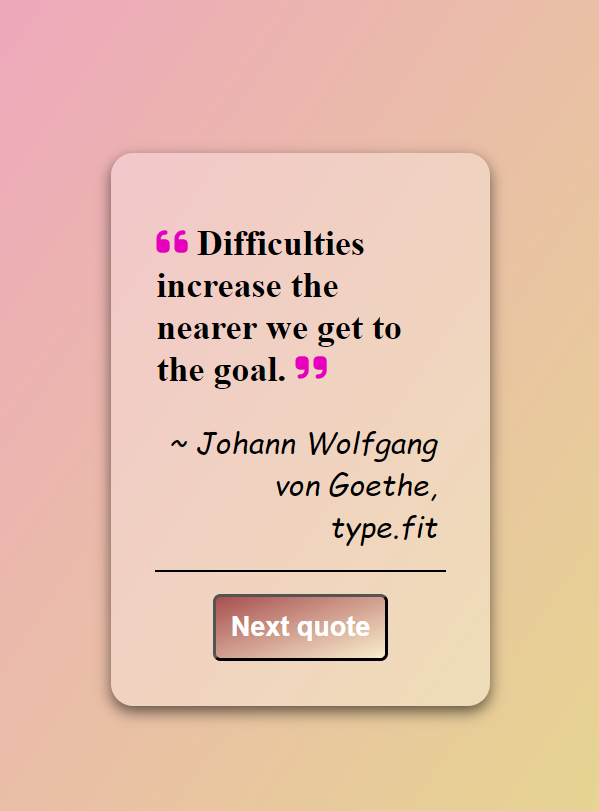

# Quote Generator 

## Table of contents

1. Author
2. Features
3. Project views
4. Links
5. Tech stack

## Author

- [Esther Kalu](https://github.com/Kaeschindi1)

## Features

- A Responsive Quote Generator created using HTML, CSS and JavaScript.

- A fetch method was used to generate our quotes

- Credit goes to [Type Fit](https://type.fit/api/quotes)

## Project views

Desktop

Mobile

## 🔗 Links

## Tech stack

**Client:**

